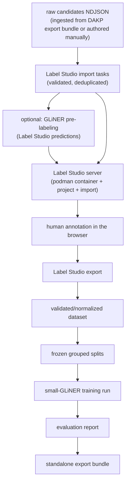

# MedliNER

MedliNER is a standalone, local pipeline for producing a reviewed medical NER dataset and fine-tuning a small GLiNER checkpoint. Its first use cases are extracting `disease` and `phenotype` mentions from `indication` and `contraindication` text.

MedliNER consumes DAKP data only through its training-data export bundle (`make ingest`); no DAKP checkout or runtime is required. The only training input is a reviewed Label Studio export.

## Labels and tasks

Entity labels:

- `disease`
- `phenotype`

Every example also has task metadata:

- `indication`
- `contraindication`

The task is context metadata, not an entity label. GLiNER is queried with both labels, while evaluation reports indication and contraindication separately.

Read [`docs/ANNOTATION_GUIDE.md`](docs/ANNOTATION_GUIDE.md) before annotation.

## Annotation

Label Studio Community Edition is free to self-host locally and provides a browser UI. The
pipeline runs it in a podman container via `make label-studio` — no separate
install needed; see [`docs/LABEL_STUDIO.md`](docs/LABEL_STUDIO.md).

Annotators do not count offsets:

> open task → click-drag/highlight the condition phrase → choose label → submit

Label Studio records character offsets automatically. MedliNER validates those offsets and converts them to GLiNER token spans.

## Install and run MedliNER

Review the safe example paths in `.envrc`, then enable direnv:

```bash
direnv allow
make sync
```

The checked-in `.envrc` exports:

| Variable | Purpose |
| --- | --- |
| `MEDLINER_EXPORT_BUNDLE` | DAKP training-data export bundle directory ingested by `make ingest` |
| `MEDLINER_BENCHMARK` | NER gold benchmark materialized by `make ingest` |
| `MEDLINER_RAW_CANDIDATES` | raw candidates NDJSON, ingested from the DAKP export bundle or authored manually (see [`docs/CANDIDATE_TASKS.md`](docs/CANDIDATE_TASKS.md)) |
| `MEDLINER_LABEL_STUDIO_EXPORT` | reviewed export that feeds the pipeline |
| `MEDLINER_WORKDIR` | root for normalized data, splits, checkpoints, and reports |
| `MEDLINER_TRAIN_CONFIG` | training configuration YAML |
| `MEDLINER_PRELABEL_MODEL` / `_THRESHOLD` / `_DEVICE` | GLiNER checkpoint, score floor, and device used by `make prelabel` |
| `MEDLINER_LABEL_STUDIO_PORT` / `_IMAGE` | podman Label Studio container port and image |
| `MEDLINER_LABEL_STUDIO_USERNAME` / `_PASSWORD` / `_TOKEN` | Label Studio login created on first container boot, or an explicit API token |
| `MEDLINER_SPLIT_SEED` / `MEDLINER_REGRESSION_IDS` | split seed and IDs withheld from every split |
| `TRITON_LIBCUDA_PATH` | set automatically when the system has no `/sbin/ldconfig` (see [`docs/HARDWARE.md`](docs/HARDWARE.md)) |

Print the resolved values with `make env`. For private local overrides, create the ignored `.envrc.local`; do not put secrets or machine-specific paths into the committed `.envrc`.

Label Studio runs in a podman container started by the pipeline; it is intentionally not a
MedliNER Python dependency. The pipeline stages are Makefile targets wrapping the
`medliner` CLI. The full flow is:

1. `make ingest` — verifies the DAKP export bundle (`MEDLINER_EXPORT_BUNDLE`, default
   `data/dakp-export`) and materializes its candidates and NER gold under
   `$MEDLINER_WORKDIR/ingested/`. Alternatively author
   `data/label-studio/candidates.ndjson` by hand
   ([`docs/CANDIDATE_TASKS.md`](docs/CANDIDATE_TASKS.md)).
2. `make prelabel` *(optional)* — attaches GLiNER suggestions to the import file so
   annotators correct spans instead of drawing them. Uses
   `gliner-community/gliner_large-v2.5` with the `disease`/`phenotype` prompts and `0.35`
   threshold the sibling DAKP pipeline mines with. Suggestions only: a human accepts,
   corrects, or deletes every span ([`docs/LABEL_STUDIO.md`](docs/LABEL_STUDIO.md)).
   `make prelabel SCORE_GOLD=1` scores them against the ingested gold benchmark first.
3. `make label-studio` — builds the Label Studio import file (`make candidates` runs
   automatically when needed) and starts the annotation server. For the ingested bundle,
   pass `INPUT=$MEDLINER_WORKDIR/ingested/candidates.ndjson`; add `REIMPORT=1` to replace
   existing project tasks and `PRELABEL=1` to import the pre-labeled file with Label Studio's
   prediction pre-fill turned on.
4. Annotate in the browser at <http://localhost:9030> (span hotkeys: `1` disease, `2`
   phenotype), then `make label-studio-export` downloads the reviewed JSON to
   `MEDLINER_LABEL_STUDIO_EXPORT` (default `data/label-studio/reviewed.json`).
5. `make pipeline` — runs the remaining stages (`dataset` → `splits` → `train` →
   `evaluate` → `bundle`) in order.

Stop the annotation server with `make label-studio-stop`; annotations survive in the
container's data volume directory under `$MEDLINER_WORKDIR/label-studio/server-data`. For a
group session, `MEDLINER_LABEL_STUDIO_HOST=0.0.0.0` exposes the server on the LAN,
`ANNOTATORS="alice:pw,bob:pw"` pre-creates accounts, and `WARMUP=1` seeds a separate
gold warm-up project (see [`docs/LABEL_STUDIO.md`](docs/LABEL_STUDIO.md)).

The required first GPU check is a one-step smoke run of the training code path:

```bash
SMOKE=1 make pipeline   # run once before the full `make pipeline`
```

`make check` runs the tests, lint, and format checks; `make coverage` adds a coverage
report.

Override any environment path without editing files, for example:

```bash
MEDLINER_LABEL_STUDIO_EXPORT=$PWD/data/label-studio/reviewed.json make pipeline
```

## Pipeline

The stages cover the whole workflow except the human annotation step itself:



Every stage is a plain CLI command (`uv run medliner <stage>`) with a Makefile wrapper. The source export, normalized JSONL, split manifest, training configuration, checkpoint, and evaluation report are all explicit artifacts under `$MEDLINER_WORKDIR`.

## Training target

The default base model is `urchade/gliner_small-v2.1`. A smaller checkpoint is intentional: full training of a large GLiNER checkpoint is not required for this project and may exceed 12 GB VRAM. The configuration uses batch size 1, gradient accumulation, bounded sequence length, mixed precision when supported, checkpointing, and resume behavior. Large-checkpoint training is an optional later comparison. See [`docs/HARDWARE.md`](docs/HARDWARE.md): the RTX 5070 Ti requires a Torch wheel containing `sm_120` kernels.

GLiNER 0.2.28's training records use model tokens and inclusive token end indexes. MedliNER preserves the original character-level annotations so this conversion is auditable and tested.

Two GLiNER behaviours would otherwise discard supervision without saying so, and are turned into
errors at conversion time: text beyond `max_len` (384 word tokens) is truncated with only a
warning, and a gold span wider than `max_width` (12 word tokens) is never enumerated as a span
candidate. The batch entity vocabulary is also pinned to the two labels, because a batch of
purely no-entity examples otherwise has zero entity types and the loss fails outright. See
[`docs/TRAINING.md`](docs/TRAINING.md).

## Evaluation gates

Reports include:

- strict exact `(start, end, label)` precision/recall/F1;
- lenient boundary-only F1;
- indication versus contraindication metrics;
- source-family metrics;
- no-entity false-positive rate;
- gold-benchmark regression results from the DAKP NER gold set ingested by `make ingest` (`$MEDLINER_BENCHMARK`);
- a truncation block naming any example over the model's word budget.

The tuned model must be compared with the untuned small checkpoint before it is selected for packaging. The ingested DAKP gold benchmark remains held out from training.

## Artifact bundle

`make pipeline` creates a standalone directory containing:

- `checkpoint/`;
- `labels.json`;
- `annotation_policy.md`;
- `dataset.jsonl` and split manifest;
- `training_config.yaml` — the configuration the run actually used, taken from the checkpoint's
  own metadata rather than the current contents of `configs/`;
- `metrics.json`;
- `provenance.json` — base model, selected checkpoint, best validation F1, dataset/metrics/tree
  hashes, split hash, and held-out example IDs;
- model-card inputs.

Rebuilding over a previous bundle is allowed; the build refuses to delete a non-empty directory
that is not a bundle.

Review licensing for source text and the base checkpoint before uploading anything publicly.
