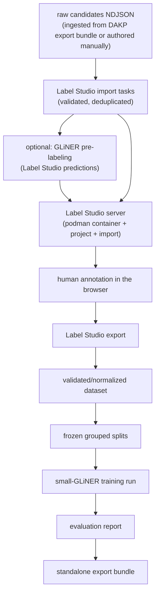

# MedliNER

MedliNER is a standalone, local pipeline for producing a reviewed medical NER dataset and fine-tuning a small GLiNER checkpoint. Its first use cases are extracting `disease` and `phenotype` mentions from `indication` and `contraindication` text.

MedliNER consumes DAKP data through a reviewed export bundle or raw candidates file; no DAKP checkout or runtime is required. The only training input is a reviewed Label Studio export. Set machine-specific paths in the ignored `.envrc.local`.

## Labels and tasks

Entity labels:

- `disease`
- `phenotype`

Every example also has task metadata:

- `indication`
- `contraindication`

The task is context metadata, not an entity label. GLiNER is queried with both labels, while evaluation reports indication and contraindication separately.

Read [`docs/ANNOTATION_GUIDE.md`](docs/ANNOTATION_GUIDE.md) before annotation.

## Annotation

Label Studio Community Edition is free to self-host locally and provides a browser UI. The
pipeline runs it in a podman container via `make annotate` — no separate
install needed; see [`docs/LABEL_STUDIO.md`](docs/LABEL_STUDIO.md).

Annotators do not count offsets:

> open task → click-drag/highlight the condition phrase → choose label → submit

Label Studio records character offsets automatically. MedliNER validates those offsets and converts them to GLiNER token spans.

## Install and run MedliNER

Review the safe example paths in `.envrc`, then enable direnv:

```bash
direnv allow
make setup
```

The checked-in `.envrc` exports:

| Variable | Purpose |
| --- | --- |
| `MEDLINER_RAW_CANDIDATES` | raw candidates NDJSON (default `data/label-studio/candidates.ndjson`; see [`docs/CANDIDATE_TASKS.md`](docs/CANDIDATE_TASKS.md)) |
| `MEDLINER_BENCHMARK` | NER gold benchmark (default `data/materialized/ingested/ner_gold.json`) |
| `MEDLINER_EXPORT_BUNDLE` | older DAKP bundle layout, only for `uv run medliner ingest` |
| `MEDLINER_LABEL_STUDIO_EXPORT` | reviewed production export that feeds the pipeline |
| `MEDLINER_ONBOARDING_CONFIG` | onboarding policy config (default `configs/onboarding.json`) |
| `MEDLINER_ONBOARDING_EXPORT` | downloaded `Onboarding` project export |
| `MEDLINER_ONBOARDING_REQUIRED` | opt-in: require a current passing onboarding promotion before dataset acceptance (default off) |
| `MEDLINER_WORKDIR` | root for normalized data, splits, checkpoints, reports, and onboarding state |
| `MEDLINER_TRAIN_CONFIG` | training configuration YAML |
| `MEDLINER_PRELABEL_MODEL` / `_THRESHOLD` / `_DEVICE` | GLiNER checkpoint, score floor, and device used by the pre-labeling step of `make prepare` |
| `MEDLINER_LABEL_STUDIO_PORT` / `_IMAGE` | podman Label Studio container port and image |
| `MEDLINER_LABEL_STUDIO_USERNAME` / `_PASSWORD` / `_TOKEN` | Label Studio login created on first container boot, or an explicit API token |
| `MEDLINER_LLM_URL` | local LLM server for `make prepare`, `make shorten`, and `make synthesize` (default `http://127.0.0.1:8080`, started by `make llm`; set `MODELS_DIR` for the model checkout) |
| `MEDLINER_SHORTEN_MAX_WORDS` | word threshold for shortening, ≈3-4 short sentences (default `48`; applied to the sampled batch during `make prepare`) |
| `MEDLINER_SHORTEN_WORKERS` | parallel rewrite requests (default `4`, matching the server's four slots) |
| `MEDLINER_SHORTEN_CACHE` | sqlite cache of successful rewrites (default `<workdir>/shorten-cache.sqlite3`) |
| `MEDLINER_SYNTH_*` | semi-supervised synthesis knobs: variant ratio per gold train example (default 10) with an acceptance floor (5), attempts per slot (3), rewrite word budget (250), Jaccard similarity floor (0.3), parallel requests (2), and the sqlite reply cache (see [Semi-supervised training](#semi-supervised-training)) |
| `MEDLINER_SAMPLE_*` | import sampling: per-task targets (default 3,000/2,000), seed, word cap, run cap, edge fraction (see [`docs/CANDIDATE_TASKS.md`](docs/CANDIDATE_TASKS.md)) |
| `MEDLINER_SPLIT_SEED` / `MEDLINER_REGRESSION_IDS` | split seed and IDs withheld from every split |
| `TRITON_LIBCUDA_PATH` | set automatically when the system has no `/sbin/ldconfig` (see [`docs/HARDWARE.md`](docs/HARDWARE.md)) |

For private local overrides, create the ignored `.envrc.local`; do not put secrets or machine-specific paths into the committed `.envrc`.

Label Studio runs in a podman container started by the pipeline; it is intentionally not a
MedliNER Python dependency. The pipeline stages are a small set of Makefile targets wrapping
the `medliner` CLI (every stage also runs standalone as `uv run medliner <stage>`). The full flow is:

1. `make setup` — installs the uv environment.
2. `make prepare` — validates/dedupes the raw candidates, samples the 5K mostly-edge-case
   import batch, and attaches GLiNER suggestions so annotators correct spans instead of
   drawing them. Suggestions only: a human accepts, corrects, or deletes every span
   ([`docs/LABEL_STUDIO.md`](docs/LABEL_STUDIO.md)).
   `uv run medliner prelabel --score-gold` scores the suggestions against the gold
   benchmark before they go in front of a room.
3. (Optional, for a live session) `make onboarding` — provisions the separate answer-free
   `Onboarding` project and assigns a four-task quiz to **every** annotator account at once,
   so nobody has to be named on the command line. After everyone annotates their tasks,
   `make onboarding-promote` exports the quiz, scores every attempt, and promotes every
   passing annotator (3/4 or 4/4). Rerun `make onboarding` for a fresh round; each attempt
   selects a new four-task subset from the ten-case bank.
4. `make annotate` — starts the production `MedliNER` project with the tasks imported.
   Annotate in the browser at <http://localhost:9030> (span hotkeys: `1` disease,
   `2` phenotype), then `make export` downloads the reviewed JSON to
   `MEDLINER_LABEL_STUDIO_EXPORT`. Stop the server with `make stop`; annotations survive in
   the container's data volume directory under `$MEDLINER_WORKDIR/label-studio/server-data`.
5. `make train` — runs the remaining stages (`dataset` → `splits` → `train` → `evaluate` →
   `bundle`) in order. Onboarding is optional: set `MEDLINER_ONBOARDING_REQUIRED=1` to accept
   only production annotations from promoted users. When no synthetic pool exists yet, the
   pipeline trains gold-only with a notice; once `make synthesize` has produced a pool, the
   training step mixes it in at the configured `synthetic_weight` (see below).

For a group session, `MEDLINER_LABEL_STUDIO_HOST=0.0.0.0` exposes the server on the LAN and
`MEDLINER_LABEL_STUDIO_ANNOTATORS="alice:pw,bob:pw"` pre-creates accounts. See
[`docs/LABEL_STUDIO.md`](docs/LABEL_STUDIO.md) for onboarding details and the Community Edition
limitation: project separation is an operational gate, not per-user API access control.

The required first GPU check is a one-step smoke run of the training code path:

```bash
uv run medliner pipeline --smoke   # run once before the full `make train`
```

`make check` runs the tests, lint, and format checks.

Override any environment path without editing files, for example:

```bash
MEDLINER_LABEL_STUDIO_EXPORT=$PWD/data/label-studio/reviewed.json make train
```

## Pipeline

The stages cover the whole workflow except the human annotation step itself:



Every stage is a plain CLI command (`uv run medliner <stage>`) with a Makefile wrapper. The source export, normalized JSONL, split manifest, training configuration, checkpoint, and evaluation report are all explicit artifacts under `$MEDLINER_WORKDIR`.

## Training target

The default base model is `urchade/gliner_small-v2.1`. A smaller checkpoint is intentional: full training of a large GLiNER checkpoint is not required for this project and may exceed 12 GB VRAM. The configuration uses batch size 1, gradient accumulation, bounded sequence length, mixed precision when supported, checkpointing, and resume behavior. Large-checkpoint training is an optional later comparison. See [`docs/HARDWARE.md`](docs/HARDWARE.md): the RTX 5070 Ti requires a Torch wheel containing `sm_120` kernels.

GLiNER 0.2.28's training records use model tokens and inclusive token end indexes. MedliNER preserves the original character-level annotations so this conversion is auditable and tested.

Two GLiNER behaviours would otherwise discard supervision without saying so, and are turned into
errors at conversion time: text beyond `max_len` (384 word tokens) is truncated with only a
warning, and a gold span wider than `max_width` (12 word tokens) is never enumerated as a span
candidate. The batch entity vocabulary is also pinned to the two labels, because a batch of
purely no-entity examples otherwise has zero entity types and the loss fails outright. See
[`docs/TRAINING.md`](docs/TRAINING.md).

## Semi-supervised training

MedliNER can multiply the reviewed gold train split with machine-paraphrased twins of itself.
The stage is explicit, gated, and fully separate from evaluation: validation/test splits and
the held-out DAKP gold benchmark never receive synthetic examples (enforced at training time).

1. `make llm` — start the local LLM server (the synthesis engine has no other model backend).
2. `make synthesize` — for every gold train example, fill ten variant slots
   (`MEDLINER_SYNTH_RATIO`, the 10x target) with distinct prompt-style paraphrases. Every
   rewrite must pass the engine's divergence gates — mentions preserved verbatim and in order,
   content-word Jaccard similarity at or above 0.3, length ratio within `[0.5, 2.0]`,
   schema-valid, and within GLiNER's budgets — or it is rejected with a counted, stable
   reason. A run accepting fewer than `MEDLINER_SYNTH_MIN_RATIO` (default 5) variants per gold
   example exits non-zero after writing its manifest; a `--limit` trial run cannot silently
   turn that floor off.
3. `make train` — training mixes the pool into the gold train split at `synthetic_weight: 0.1`:
   every synthetic example contributes ten times less to the loss than a gold example (weight
   1.0). GLiNER 0.2.28 has no native per-sample weighting, so MedliNER implements it with a
   tested `Trainer.compute_loss` override; gold-only numerics are untouched
   ([`docs/TRAINING.md`](docs/TRAINING.md)).

Accepted paraphrases are stamped `source.family='synthetic'` and can never claim human
provenance, so machine-made rows stay auditable. The artifact bundle ships the synthetic
examples, their manifest, and the synthetic weight/count/manifest hash in `provenance.json`.

Fallback semantics: `make train` wraps `medliner pipeline`, which does not expose
`--no-synthetic`. When no pool exists yet, the pipeline selects the gold-only fallback
itself and prints a notice instead of failing; when a pool exists, it is mixed in at the
configured `synthetic_weight`. Direct `medliner train` stays strict: a configured
`synthetic_weight` with no pool, or a present pool with no configured weight, fails loudly
rather than silently training gold-only or training synthetic examples at the full gold
weight. The explicit forced gold-only route is `uv run medliner train --no-synthetic` once
the dataset/splits stages have produced their artifacts.

## Evaluation gates

Reports include:

- strict exact `(start, end, label)` precision/recall/F1;
- lenient boundary-only F1;
- indication versus contraindication metrics;
- source-family metrics;
- no-entity false-positive rate;
- gold-benchmark regression results from the DAKP NER gold set (`$MEDLINER_BENCHMARK`);
- a truncation block naming any example over the model's word budget.

The tuned model must be compared with the untuned small checkpoint before it is selected for packaging. The ingested DAKP gold benchmark remains held out from training.

## Artifact bundle

`make train` creates a standalone directory containing:

- `checkpoint/`;
- `labels.json`;
- `annotation_policy.md`;
- `dataset.jsonl` and split manifest;
- `synthetic_examples.jsonl` and `synthetic_manifest.json` — the gated synthetic pool, when the
  run mixed one in;
- `training_config.yaml` — the configuration the run actually used, taken from the checkpoint's
  own metadata rather than the current contents of `configs/`;
- `metrics.json`;
- `provenance.json` — base model, selected checkpoint, best validation F1, dataset/metrics/tree
  hashes, split hash, held-out example IDs, and (for semi-supervised runs) the synthetic
  weight, count, and manifest hash;
- model-card inputs.

Rebuilding over a previous bundle is allowed; the build refuses to delete a non-empty directory
that is not a bundle.

Review licensing for source text and the base checkpoint before uploading anything publicly.
