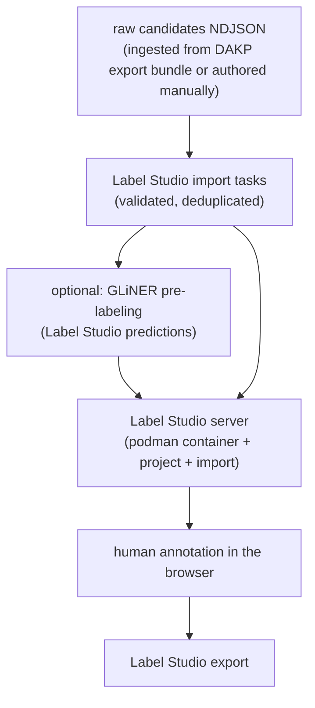

# MedliNER

MedliNER is a standalone, local pipeline for producing a reviewed medical NER dataset, with a small GLiNER checkpoint as the pre-labeler. Its first use cases are extracting disease and phenotypic-feature mentions from `indication` and `contraindication` text.

MedliNER consumes DAKP data through a reviewed export bundle or raw candidates file; no DAKP checkout or runtime is required. Set machine-specific paths in the ignored `.envrc.local`.

## Labels and tasks

Entity labels:

- `DiseaseOrPhenotypicFeature`

Every example also has task metadata:

- `indication`
- `contraindication`

The task is context metadata, not an entity label. GLiNER is queried with the single condition label, while benchmark scoring reports indication and contraindication separately.

Read [`docs/ANNOTATION_GUIDE.md`](docs/ANNOTATION_GUIDE.md) before annotation.

## Annotation

Label Studio Community Edition is free to self-host locally and provides a browser UI. The
pipeline runs it in a podman container via `make annotate` — no separate
install needed; see [`docs/LABEL_STUDIO.md`](docs/LABEL_STUDIO.md).

Annotators do not count offsets:

> open task → click-drag/highlight the condition phrase → choose label → submit

Label Studio records character offsets automatically; MedliNER validates them against the canonical schema.

## Install and run MedliNER

Review the safe example paths in `.envrc`, then enable direnv:

```bash
direnv allow
make setup
```

The checked-in `.envrc` exports:

| Variable | Purpose |
| --- | --- |
| `MEDLINER_RAW_CANDIDATES` | raw candidates NDJSON (default `data/label-studio/candidates.ndjson`; see [`docs/CANDIDATE_TASKS.md`](docs/CANDIDATE_TASKS.md)) |
| `MEDLINER_BENCHMARK` | NER gold benchmark (default `data/materialized/ingested/ner_gold.json`) |
| `MEDLINER_EXPORT_BUNDLE` | older DAKP bundle layout, only for `uv run medliner ingest` |
| `MEDLINER_LABEL_STUDIO_EXPORT` | destination for the reviewed production export downloaded by `make export` |
| `MEDLINER_ONBOARDING_CONFIG` | onboarding policy config (default `configs/onboarding.json`) |
| `MEDLINER_ONBOARDING_EXPORT` | downloaded `Onboarding` project export |
| `MEDLINER_WORKDIR` | root for ingested data, Label Studio import files, and onboarding state |
| `MEDLINER_PRELABEL_MODEL` / `_THRESHOLD` / `_DEVICE` | GLiNER checkpoint, score floor, and device used by the pre-labeling step of `make prepare` |
| `MEDLINER_LABEL_STUDIO_PORT` / `_IMAGE` | podman Label Studio container port and image |
| `MEDLINER_LABEL_STUDIO_USERNAME` / `_PASSWORD` / `_TOKEN` | Label Studio login created on first container boot, or an explicit API token |
| `MEDLINER_LLM_URL` | local LLM server for `make prepare` and `make shorten` (default `http://127.0.0.1:8080`, started by `make llm`; set `MODELS_DIR` for the model checkout) |
| `MEDLINER_SHORTEN_MAX_WORDS` | word threshold for shortening, ≈3-4 short sentences (default `48`; applied to the sampled batch during `make prepare`) |
| `MEDLINER_SHORTEN_WORKERS` | parallel rewrite requests (default `4`, matching the server's four slots) |
| `MEDLINER_SHORTEN_CACHE` | sqlite cache of successful rewrites (default `<workdir>/shorten-cache.sqlite3`) |
| `MEDLINER_SAMPLE_*` | import sampling: per-task targets (default 600/400), seed, word cap, run cap, edge fraction (see [`docs/CANDIDATE_TASKS.md`](docs/CANDIDATE_TASKS.md)) |
| `TRITON_LIBCUDA_PATH` | set automatically when the system has no `/sbin/ldconfig` (see [`docs/HARDWARE.md`](docs/HARDWARE.md)) |

For private local overrides, create the ignored `.envrc.local`; do not put secrets or machine-specific paths into the committed `.envrc`.

Label Studio runs in a podman container started by the pipeline; it is intentionally not a
MedliNER Python dependency. The pipeline stages are a small set of Makefile targets wrapping
the `medliner` CLI (every stage also runs standalone as `uv run medliner <stage>`). The full flow is:

1. `make setup` — installs the uv environment.
2. `make prepare` — validates/dedupes the raw candidates, samples the 1K mostly-edge-case
   import batch, and attaches GLiNER suggestions so annotators correct spans instead of
   drawing them. Suggestions only: a human accepts, corrects, or deletes every span
   ([`docs/LABEL_STUDIO.md`](docs/LABEL_STUDIO.md)).
   `uv run medliner prelabel --score-gold` scores the suggestions against the gold
   benchmark before they go in front of a room.
3. (Optional, for a live session) `make onboarding` — provisions the separate answer-free
   `Onboarding` project and assigns a four-task quiz to **every** annotator account at once,
   so nobody has to be named on the command line. After everyone annotates their tasks,
   `make onboarding-promote` exports the quiz, scores every attempt, and promotes every
   passing annotator (3/4 or 4/4). Rerun `make onboarding` for a fresh round; each attempt
   selects a new four-task subset from the ten-case bank.
4. `make annotate` — starts the production `MedliNER` project with the tasks imported.
   Annotate in the browser at <http://localhost:9030> (span hotkey: `1`
   DiseaseOrPhenotypicFeature), then `make export` downloads the reviewed JSON to
   `MEDLINER_LABEL_STUDIO_EXPORT`. Stop the server with `make stop`; annotations survive in
   the container's data volume directory under `$MEDLINER_WORKDIR/label-studio/server-data`.

For a group session, `MEDLINER_LABEL_STUDIO_HOST=0.0.0.0` exposes the server on the LAN and
`MEDLINER_LABEL_STUDIO_ANNOTATORS="alice:pw,bob:pw"` pre-creates accounts. See
[`docs/LABEL_STUDIO.md`](docs/LABEL_STUDIO.md) for onboarding details and the Community Edition
limitation: project separation is an operational gate, not per-user API access control.

`make check` runs the tests, lint, and format checks.

Override any environment path without editing files, for example:

```bash
MEDLINER_LABEL_STUDIO_EXPORT=$PWD/data/label-studio/reviewed.json make export
```

## Pipeline

The stages cover the whole workflow except the human annotation step itself:



Every stage is a plain CLI command (`uv run medliner <stage>`) with a Makefile wrapper. The
raw candidates, sampled import files, and pre-label manifests are all explicit artifacts
under `$MEDLINER_WORKDIR`.

Review licensing for source text and the pre-labeling checkpoint before uploading anything publicly.
